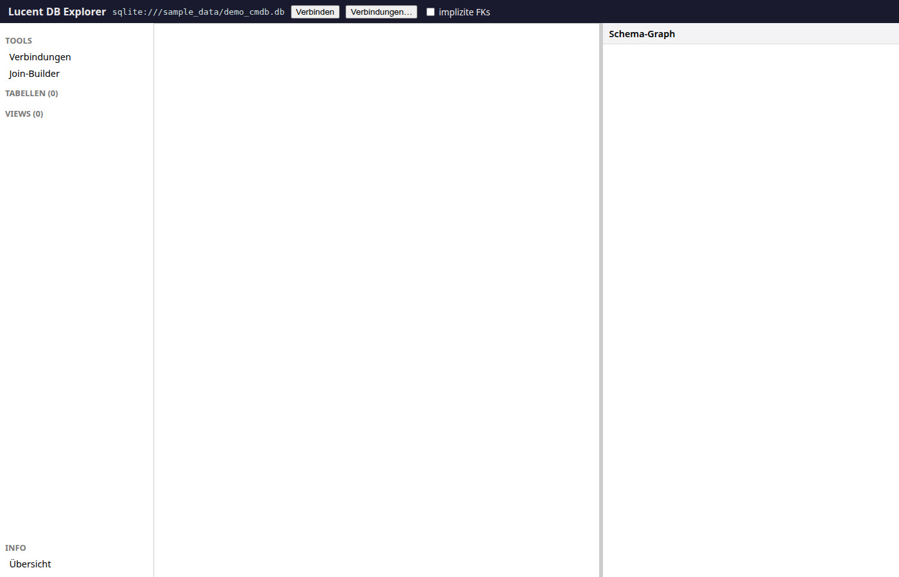
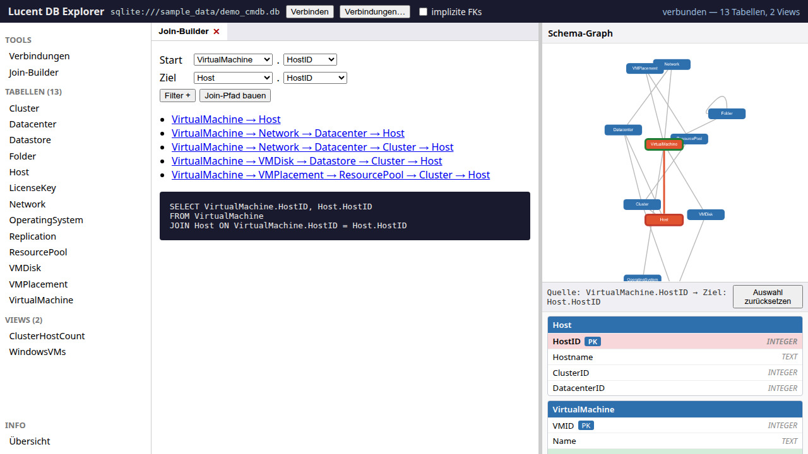

# Schnellstart

## App starten

```bash
bash run.sh --start
# oder mit automatischem Setup-Check:
bash run.sh
```

Die App ist danach erreichbar unter: **http://127.0.0.1:5057**



**Windows (PowerShell):**
```powershell
.\run.ps1 -Action start
```

## Erste Schritte im Browser

### 1. Demo-Datenbank verbinden

Beim ersten Start ist die mitgelieferte Demo-CMDB bereits vorbelegt:

```
sqlite:///sample_data/demo_cmdb.db
```

Klick auf **„Schema laden"** — der Objekt-Browser links füllt sich mit Tabellen und Views.

### 2. FK-Graph erkunden

Der FK-Graph rechts zeigt alle Tabellen als Knoten und die Foreign-Key-Beziehungen
als Kanten. Gestrichelte Kanten = implizit erkannte FKs (per Checkbox aktivierbar).

### 3. Join-Pfad berechnen

Im **Join-Builder**-Tab:

1. Start-Tabelle und Spalte wählen
2. Ziel-Tabelle und Spalte wählen
3. Optional: Filter hinzufügen (Tabelle · Spalte · Operator · Wert)
4. Klick auf **„Join-Pfad berechnen"**

Das Ergebnis: parametrisiertes SQL + der Pfad wird im Graph farblich hervorgehoben.

**Tipp — Direkte Graph-Auswahl (AP-1):** Doppelklick auf einen Graphknoten
öffnet eine UML-Karte direkt im Graph-Panel. Spalte anklicken = Quelle setzen;
dann zweite Tabelle doppelklicken + Spalte = Ziel. Join-Builder füllt sich
automatisch, der Pfad wird sofort berechnet.



### 4. Eigene Datenbank verbinden

Über **Tools → Verbindungen** das Verbindungsformular öffnen:

- **SQLite** — Dateipfad zur `.db`-Datei
- **PostgreSQL** — Host, Port, Datenbankname, Benutzer, Passwort
- **MySQL/MariaDB** — wie PostgreSQL
- **MS SQL Server** — wie PostgreSQL (zusätzlich ODBC-Treiber erforderlich)

Verbindung testen → **Verbinden** → Schema laden.

## Demo-Datenbank neu erzeugen

```bash
bash run.sh --demo-db
# oder:
python3 sample_data/build_demo_db.py
```

Die Demo-CMDB enthält absichtlich komplexe Strukturen:
- Diamant-Pfade (mehrdeutige Routen zwischen zwei Tabellen)
- Zusammengesetzte Foreign Keys
- Selbstreferenzen und Mehrfach-FKs
- Isolierte Tabellen

Zusätzlich gibt es `demo_cmdb_nofk.db` — identische Daten, aber **ohne deklarierte
Foreign Keys** — ideal zum Testen der Implizite-FK-Heuristik.

## Menü-Übersicht

```
bash run.sh              # Interaktives Menü

  [1] App starten        → http://127.0.0.1:5057
  [2] Setup              → venv anlegen, Abhängigkeiten installieren
  [3] Tests              → pytest (81 Tests)
  [4] Demo-DB            → sample_data/ neu generieren
  [5] Version            → aktuelle App-Version anzeigen
```
