# Lucent DB Explorer

**Lucent DB Explorer** ist ein Flask-Web-Werkzeug, das aus einer Live-Datenbankverbindung
einen FK-Graphen baut und Join-Pfade zwischen beliebigen Tabellen berechnet.

**„Wie komme ich von Tabelle A zu B?"** — diese Frage beantwortet der Explorer mit
generierten, parametrisierten SQL-Abfragen.

  

  

  

    <section class="adb-home-footer__col" data-adb-home-col="heatmap">
      <h3 class="adb-home-footer__title">Aktivität (365 Tage)</h3>
      

    </section>
    <section class="adb-home-footer__col" data-adb-home-col="insights">
      <h3 class="adb-home-footer__title">Insights</h3>
      

    </section>
  

## Was kann Lucent DB Explorer?

- **Schema-Reflection** — Tabellen, Views, Spalten und Foreign Keys aus jeder Datenbankverbindung lesen
- **FK-Graph** — interaktiver Cytoscape.js-Graph des vollständigen Beziehungsnetzes; der gewählte Join-Pfad wird hervorgehoben
- **Join-Pfad-Builder** — k-kürzeste Pfade zwischen Start- und Zieltabelle, mit optionalen WHERE-Filtern
- **SQL-Generierung** — parametrisierter, read-only `SELECT … JOIN …` sofort kopierbereit
- **Implizite FKs** — Heuristik erkennt Beziehungen ohne deklarierte Constraints (Checkbox; gestrichelte Kanten)
- **Datenvorschau** — erste 100 Zeilen jeder Tabelle / View
- **Verbindungs-Manager** — strukturiertes Formular für SQLite, PostgreSQL, MySQL/MariaDB, MS SQL Server

## Tech-Stack

| Komponente | Technologie |
|---|---|
| Backend | Python · Flask |
| Datenbankzugriff | SQLAlchemy ≥ 2.0 (read-only) |
| Graphen | NetworkX ≥ 3.0 |
| Visualisierung | Cytoscape.js 3.30.2 (lokal gebundelt) |
| Dokumentation | Zensical (MkDocs-kompatibel) |

## Lucent Hub

Lucent DB Explorer läuft im Lucent Hub Ökosystem auf Port **5057**.
Registriert via `lucent-hub.yml`. Dokumentation auf Port **8046**.
