  

    
  

  

    
📑 AP-Matching · Kurzbeschreibung

    

      
⚙️ Engine / Fundament

      
<b>AP-11</b> Composite-FK: ON … AND …

      
🔌 Verbindungen &amp; Backends

      
<b>AP-2</b> Verbinden-Fehler entschärft

      
<b>AP-10</b> Verbindungen in der Topbar

      
<b>AP-12</b> MSSQL real testbar

      
<b>AP-22</b> Implizite FKs (opt-in)

      
🧩 Join-Builder &amp; SQL-Ausgabe

      
<b>AP-3</b> SQL-Optionen: DISTINCT/ORDER BY/LIMIT/IN

      
<b>AP-4</b> Mehrere SELECT-Spalten

      
<b>AP-5</b> Ausgabebereich: SELECT → Tabelle

      
<b>AP-6</b> Ausgabe-Steuerung: Zeilen/Refresh

      
<b>AP-9</b> Ergebnisliste maximiert

      
<b>AP-20</b> Copy-Icon am SELECT

      
<b>AP-23</b> Join-Maske vereinheitlicht

      
<b>AP-25</b> SQL-Statement-Analyzer

      
<b>AP-29</b> SQL-Dialekt umschalten

      
<b>AP-30</b> N-1-Stern (mehrere Lookup-Ziele)

      
<b>AP-36</b> Fan-out-Richtung pro Join (N-1/1-N)

      
<b>AP-37</b> Start⇄Ziel-Tausch

      
<b>AP-38</b> Kopierbares lauffähiges SQL

      
<b>AP-39</b> SQL-Analyzer vertieft (Struktur/Lints)

      
<b>AP-40</b> Graph-Legende + Marker-Fix

      
<b>AP-41</b> Join-Typ pro Schritt (LEFT/RIGHT/FULL)

      
<b>AP-42</b> Join-Builder-Politur

      
<b>AP-43</b> Lesbares mehrzeiliges SQL-Layout

      
<b>AP-44</b> Kompakter + NULL/Status

      
<b>AP-45</b> Spaltenkopf-Aktionen + Filter-DISTINCT

      
<b>AP-46</b> Detailkarten folgen der Auswahl

      
<b>AP-47</b> Pfad-Indikator + Waisen-Chip

      
<b>AP-48</b> Analyzer-Textbox + Tippfehler-Lint

      
<b>AP-49</b> Analyzer-Feinschliff + ANSI-Fix

      
🕸️ Graph-Visualisierung

      
<b>AP-1</b> Graph-Interaktion: UML-Karte → Pfad

      
<b>AP-7</b> Feiner Graph-Zoom

      
<b>AP-8</b> Fix Auswahl-Reset

      
<b>AP-13</b> UI-Politur: Suchfeld/Splitter/Re-Layout

      
<b>AP-16</b> dagre-Layout (minimale Kreuzungen)

      
<b>AP-21</b> Kosmetik: Balkenhöhe

      
<b>AP-28</b> Scroll nur im Ergebnis

      
<b>AP-32</b> Zoom-Slider in der Kopfzeile

      
🗂️ Daten &amp; UI-Rahmen

      
<b>AP-18</b> Multi-Tabellen-Join

      
🚀 Deployment &amp; Betrieb

      
<b>AP-14</b> Python-3.14 / AppImage

      
<b>AP-15</b> abbruchsicher + idempotent

      
<b>AP-17</b> Delivery-Verzeichnis (gestrichen → GitHub-Releases)

      
<b>AP-31</b> Terminal-Server (Multi-User)

      
<b>AP-33</b> Logging sauber

      
<b>AP-34</b> Tray-Icon-Launcher

      
<b>AP-35</b> run.ps1: leeres venv-Fix

      
📚 Doku &amp; Prozess

      
<b>AP-19</b> .pattern_transfer

      
<b>AP-24</b> Session-KPIs (dev-intern)

      
<b>AP-26</b> Audit-Sessions

      
<b>AP-27</b> Insights

    

  

  <section class="adb-home-footer__col" data-adb-home-col="heatmap">
    <h3 class="adb-home-footer__title">Aktivität (365 Tage)</h3>
    

  </section>

  <section class="adb-home-footer__col" data-adb-home-col="insights">
    <h3 class="adb-home-footer__title">Insights</h3>
    

  </section>

