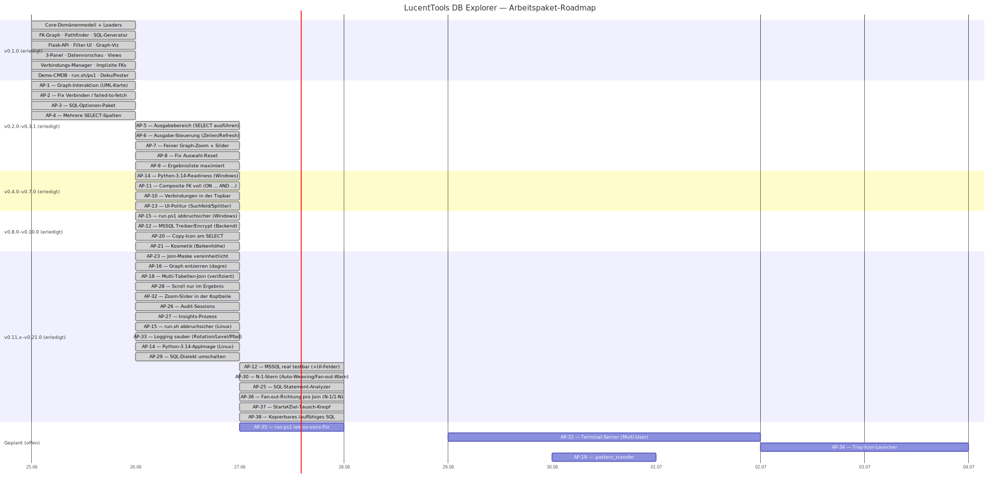

# Roadmap

## Phasen-Timeline

---

## Offene Arbeitspakete

- **AP-19** — `.pattern_transfer`: projektlokale Pattern sammeln und global
  zusammenführen
- **AP-31** — Terminal-Server-Tauglichkeit (Multi-User: dynamischer Port,
  Pro-Nutzer-`config.json`/`Logs/`, WSGI-Server)
- **AP-34** — Tray-Icon-Launcher (versteckte Konsole, sauberes Beenden, Auto-Browser)
- **AP-35** — `run.ps1`: leeres venv gilt fälschlich als „vollständig" (Folgefund
  aus AP-15; Fix wie in `run.sh`, signiertes Skript → eigene Windows-Session)

---

## Erledigte Arbeitspakete

**v0.1.0** (2026-06-25): Core-Domänenmodell, Loader, FK-Graph, Pathfinder,
SQL-Generator, Flask-API, Filter-UI, Graph-Visualisierung, implizite FKs,
3-Panel-Layout, Datenvorschau, Views, Verbindungs-Manager, Demo-CMDB,
Doku/AppImage/Projektposter.

**v0.2.0 – v0.3.1** (2026-06-26):

- **AP-1** — Interaktive Pfad-Auswahl im Graph (Doppelklick → UML-Karte → Sync)
- **AP-2** — Fix „Verbinden": klare Meldung statt „failed to fetch"
- **AP-3** — SQL-Optionen-Paket (DISTINCT · ORDER BY · LIMIT · IS NULL/IN/BETWEEN)
- **AP-4** — Mehrere SELECT-Spalten
- **AP-5** — Tabellarischer Ausgabebereich (generiertes SELECT ausführen) — v0.2.0
- **AP-6** — Ausgabe-Steuerung: Zeilen-Auswahl (200/400/Alle) + „Aktualisieren" — v0.3.0
- **AP-7** — Feiner Graph-Zoom + Zoom-Slider mit %-Anzeige — v0.3.0
- **AP-8** — Fix „Auswahl zurücksetzen" (Pfad-Highlight + UML-Karten leeren) — v0.3.0
- **AP-9** — Ergebnisliste unter dem Join-Builder maximiert (voller Platz nach unten) — v0.3.1

**v0.4.0 – v0.16.0** (2026-06-26 … 27):

- **AP-14** — Python-3.14-Readiness, Windows-Pfad (Wheelhouse cp312 → cp314) — v0.4.0
- **AP-11** — Composite Foreign Keys voll unterstützt (`ON … AND …`) — v0.5.0
- **AP-10** — Gespeicherte Verbindungen in der Topbar (Dropdown + Direkt-Connect) — v0.6.0
- **AP-13** — UI-Politur (Suchfeld · linker Splitter · „Neu anordnen") — v0.7.0
- **AP-15** (Teil 1, Windows) — `run.ps1` abbruchsicher + idempotent — v0.8.0
- **AP-12** — MSSQL: ODBC Driver 18 + Encrypt/Trust, klare Treiber-Fehlermeldung (Backend) — v0.9.0
- **AP-20** — Copy-Icon am generierten SELECT — v0.10.0
- **AP-21** — Kosmetik: gleiche Höhe Schema-Graph-Balken & Tab-Linie — v0.10.0
- **AP-16** — Graph entzerren: dagre (Sugiyama), minimale Linienkreuzungen — v0.11.0
- **AP-18** — Verknüpfen mehrerer Tabellen (Status geprüft: voll implementiert) — v0.11.0
- **AP-23** — Join-Builder-Maske vereinheitlicht — v0.11.0
- **AP-26** — Audit-Sessions: Prozess + Checkliste — v0.11.0
- **AP-28** — Fix: Join-Builder-Contentbereich scrollt nicht mehr — v0.11.1
- **Server-Deployment-Fixes** (PowerShell 5.1: ASCII+BOM, Start-Abbruch, Debug) — v0.11.1–v0.11.3
- **AP-32** — Zoom-%-Slider waagerecht in die Graph-Kopfzeile — v0.11.2
- **AP-27** — Insights: Ort & Einbindung geklärt — v0.11.2
- **AP-15** (Teil 2, Linux) — `run.sh` abbruchsicher + idempotent — v0.12.0
- **AP-33** — Logging sauber (Rotation · konfig. Level/Pfad · Request-Logging) — v0.13.0
- **AP-14** (Teil 2, Linux) — Python-3.14-AppImage + AppRun-Update-/Browser-Fix — v0.14.0
- **AP-29** — SQL-Dialekt umschalten (Quoting + LIMIT/TOP/FETCH je Dialekt) — v0.15.0
- **AP-12** (Abschluss) — MSSQL real getestet (ODBC 18 + Integrationstest) + UI-Felder Encrypt/Trust — v0.16.0
- **AP-30** — N-1-Stern: Auto-Weaving der Select-/ORDER-BY-/Filter-Tabellen in den Join-Baum; stilles Verwerfen entfällt; 1-N-Äste lösen nicht-blockierende Fan-out-Warnung aus — v0.17.0
- **AP-25** — SQL-Statement-Analyzer: neuer Tab parst via sqlglot (lokal, kein CDN), zeigt Typ/Tabellen/Warnungen (WRITE_STATEMENT/NO_WHERE/CARTESIAN_JOIN; mit Verbindung UNKNOWN_TABLE/UNKNOWN_COLUMN), markiert beteiligte Tabellen im Graphen; funktioniert mit und ohne Verbindung — v0.18.0
- **AP-36** — Fan-out-Richtung pro Join sichtbar: jeder Join-Schritt trägt einen Richtungs-Chip (grün N-1 / gelb 1-N) in der Pfad-Liste **und** als Kantenlabel im Graph; `/api/joinpath` liefert ein `steps`-Feld; neue Referenzseite „Fan-out-Warnung (1-N)" — v0.19.0
- **AP-37** — Start ⇄ Ziel tauschen: ⇄-Knopf neben den Ziel-Dropdowns (vertauscht Tabelle+Spalte, spiegelt Graph-Marker, baut neu); Fan-out-Doku um Beispiel 3 (verkürzen oder filtern) erweitert — v0.20.0
- **AP-38** — Kopierbares, lauffähiges SQL: Anzeige/Copy setzen Filterwerte als Literale ein (dialekt-/typbewusst), `:p0` bleibt intern für die read-only-Ausführung; `/api/joinpath` liefert `sql` + `sql_inline` — v0.21.0
- **AP-39** — SQL-Analyzer vertieft: Struktur-/Klauselanalyse (Spalten, Joins+ON, WHERE-Filter, GROUP/HAVING, ORDER BY, DISTINCT/LIMIT), Struktur-Zähler + Komplexitäts-Score (A–E), JOIN-Kanten im Graph gezeichnet, statische Lints (SELECT \*, LIKE '%…', Funktion-auf-Spalte) — read-only — v0.22.0
- **AP-40** — Graph-Legende (Farb-/Marker-Erklärung) + Fix: Join-Pfad- und Analyzer-Markierungen wechselseitig exklusiv (blaue Spur verschwindet beim Join-Bauen) — v0.23.0
- **AP-41** — Join-Typ pro Schritt (INNER/LEFT/RIGHT/FULL) im Join-Builder; `join_types` in sqlgen/API; Fix Start/Ziel-Einfärbung (grün/rot) passend zur Legende — v0.24.0
- **AP-42** — Join-Builder-Politur: verbose Fan-out-Warntext raus → kompakte 1-N-Kachel; SQL-Fenster bricht um statt H-Scroll (Copy/Paste bleibt lauffähig); Ziel-Knoten amber statt rot — v0.24.1–v0.25.0
- **AP-43** — Lesbares SQL-Layout: mehrzeilig (eine Spalte/JOIN/ON-Bedingung pro Zeile, `=` ausgerichtet bei Composite-Keys), Copy endet mit `;` — v0.26.0
- **AP-22** — Implizite FKs: Default geklärt → bleibt **opt-in** (Entscheidung)
- **AP-24** — Session-KPIs: erhoben & dev-intern dokumentiert (`session-kennzahlen.md`) (Entscheidung)

> **AP-17** (Delivery-Verzeichnis) wurde **gestrichen** — Auslieferung läuft über GitHub-Releases.

Vollständige Liste in `todo-erledigt.md`; detaillierter Stand:
[Changelog](../entwicklung/changelog.md).
