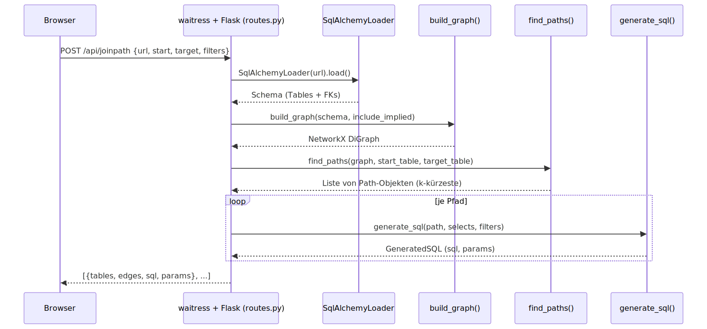

# Architektur

## Systemüberblick

LucentTools DB Explorer verbindet ein Browser-Frontend direkt mit einer
Live-Datenbankverbindung über eine Flask-API. Der Core-Layer kapselt die
gesamte Datenbanklogik — das Frontend berührt niemals direkt die Datenbank.

## Schichten

LucentTools DB Explorer folgt einem zweischichtigen Aufbau: ein `core/`-Layer für
die gesamte Datenbanklogik und ein `web/`-Layer für die Flask-API und das
Frontend.

## Datenfluss: Join-Pfad-Berechnung

## Wichtige Design-Entscheidungen

### Read-only

Der gesamte Core-Layer führt ausschließlich `SELECT`-Abfragen aus.
Schreiboperationen (INSERT/UPDATE/DELETE/DDL) sind nicht implementiert.
Objektnamen werden gegen das reflektierte Schema validiert, bevor eine
Abfrage ausgeführt wird.

### Lokale Assets

Alle JavaScript-Bibliotheken (Cytoscape.js, Mermaid) sind lokal im Projekt
gebundelt. Kein CDN-Zugriff zur Laufzeit.

### Parametrisierte Abfragen

Der SQL-Generator erzeugt immer parametrisierte Platzhalter (`?` / `:param`).
Werte werden niemals direkt in die SQL-Zeichenkette eingebettet.

### Implizite FKs

Die Heuristik (`core/implied.py`) vergleicht Spaltennamen mit Primärschlüsseln
anderer Tabellen (z. B. `user_id` → `user.id`). Nur kompatible Typen werden
berücksichtigt. Die Ergebnisse werden im Graph als gestrichelte Kanten
dargestellt und sind per Checkbox deaktivierbar.

### SQL-Analyzer (read-only)

Der SQL-Analyzer (`core/sqlanalyze.py`, Endpoint `/api/analyze`) parst ein
eingefügtes Statement ausschließlich über den sqlglot-AST und **führt es nie
aus**. Er bestimmt Statement-Typ, gelesene und geschriebene Tabellen sowie
nicht-blockierende Warnungen (Schreib-/DDL-Statement, fehlendes WHERE,
kartesischer Join; statische Lints wie `SELECT *`, nicht-sargbares `LIKE '%…'`,
Funktion-auf-Spalte, vertippte Join-Schlüsselwörter `SUSPICIOUS_ALIAS`; mit aktiver
Verbindung zusätzlich unbekannte Tabellen/Spalten gegen das reflektierte Schema).
Darüber hinaus Struktur-/Klauselanalyse (Spalten, Joins+ON, Filter, GROUP/ORDER BY),
Komplexitäts-Score und das Zeichnen der JOIN-Kanten im Graph. Er arbeitet **mit und
ohne Verbindung**: ohne Verbindung rein textuell, mit Verbindung zusätzlich mit
Schema-Abgleich und Graph-Highlight. `sqlglot` ist lokal als Wheel gebündelt (kein CDN).

Der **Join-Builder** (`/api/joinpath`, Ausführung `/api/joinpath/run`) erlaubt einen
**Join-Typ pro Schritt** (INNER/LEFT/RIGHT/FULL); das read-only Endpoint
`/api/orphan_check` zählt je Schritt, welcher Typ das Ergebnis tatsächlich ändert
(Waisen-Hinweis). Die generierte Abfrage wird parametrisiert und read-only ausgeführt;
die Anzeige/Copy-Variante setzt die Filterwerte als Literale ein (direkt lauffähig).

Die **Ergebnistabelle** ist interaktiv: `/api/joinpath/run` liefert neben `columns`/`rows`
ein **`columns_meta`** (Tabelle/Spalte je Ausgabespalte in Selektionsreihenfolge), sodass jeder
Spaltenkopf eindeutig seiner Quellspalte zugeordnet wird (auch bei gleichnamigen Spalten zweier
verbundener Tabellen). Ein Klick auf einen Spaltenkopf bietet **Sortieren/Filtern/Spalte entfernen**
(Start-/Ziel-Anker geschützt). Filter-Wertfelder werden aus dem read-only Endpoint
**`/api/distinct`** (`SELECT DISTINCT … ORDER BY …`, spalten-validiert, begrenzt auf
`config.DISTINCT_LIMIT`) mit echten Werten vorbelegt.
