# Architektur

## Systemüberblick

LucentTools DB Explorer verbindet ein Browser-Frontend direkt mit einer
Live-Datenbankverbindung über eine Flask-API, die im Normalbetrieb vom
**waitress**-WSGI-Server bereitgestellt wird (im `--debug`-Modus vom
Werkzeug-Dev-Server). Der Core-Layer kapselt die gesamte Datenbanklogik —
das Frontend berührt niemals direkt die Datenbank.

## Schichten

LucentTools DB Explorer folgt einem zweischichtigen Aufbau: ein `core/`-Layer für
die gesamte Datenbanklogik (kein Flask-Import) und ein `web/`-Layer für die Flask-API
(im Normalbetrieb über den waitress-WSGI-Server) und das Frontend. Ein optionaler
`launcher/`-Layer (Tray-Icon, AP-34) startet die App
als eigenständigen Prozess — er nutzt `core/userpaths.py`, importiert aber keinen
Web-Code.

## Datenfluss: Join-Pfad-Berechnung

## Wichtige Design-Entscheidungen

### Read-only

Der gesamte Core-Layer führt ausschließlich `SELECT`-Abfragen aus.
Schreiboperationen (INSERT/UPDATE/DELETE/DDL) sind nicht implementiert.
Objektnamen werden gegen das reflektierte Schema validiert, bevor eine
Abfrage ausgeführt wird.

### Lokale Assets

Alle JavaScript-Bibliotheken (Cytoscape.js, Mermaid) sind lokal im Projekt
gebundelt. Kein CDN-Zugriff zur Laufzeit.

### Parametrisierte Abfragen

Der SQL-Generator erzeugt immer parametrisierte Platzhalter (`?` / `:param`).
Werte werden niemals direkt in die SQL-Zeichenkette eingebettet.

### Implizite FKs

Die Heuristik (`core/implied.py`) vergleicht Spaltennamen mit Primärschlüsseln
anderer Tabellen (z. B. `user_id` → `user.id`). Nur kompatible Typen werden
berücksichtigt. Die Ergebnisse werden im Graph als gestrichelte Kanten
dargestellt und sind per Checkbox deaktivierbar.

### SQL-Analyzer (read-only)

Der SQL-Analyzer (`core/sqlanalyze.py`, Endpoint `/api/analyze`) parst ein
eingefügtes Statement ausschließlich über den sqlglot-AST und **führt es nie
aus**. Er bestimmt Statement-Typ, gelesene und geschriebene Tabellen sowie
nicht-blockierende Warnungen (Schreib-/DDL-Statement, fehlendes WHERE,
kartesischer Join; statische Lints wie `SELECT *`, nicht-sargbares `LIKE '%…'`,
Funktion-auf-Spalte, vertippte Join-Schlüsselwörter `SUSPICIOUS_ALIAS`; mit aktiver
Verbindung zusätzlich unbekannte Tabellen/Spalten gegen das reflektierte Schema).
Darüber hinaus Struktur-/Klauselanalyse (Spalten, Joins+ON, Filter, GROUP/ORDER BY),
Komplexitäts-Score und das Zeichnen der JOIN-Kanten im Graph. Er arbeitet **mit und
ohne Verbindung**: ohne Verbindung rein textuell, mit Verbindung zusätzlich mit
Schema-Abgleich und Graph-Highlight. `sqlglot` ist lokal als Wheel gebündelt (kein CDN).

Der **SQL-Builder** (`/api/joinpath`, Ausführung `/api/joinpath/run`) erlaubt einen
**Join-Typ pro Schritt** (INNER/LEFT/RIGHT/FULL); das read-only Endpoint
`/api/orphan_check` zählt je Schritt, welcher Typ das Ergebnis tatsächlich ändert
(Waisen-Hinweis). Die generierte Abfrage wird parametrisiert und read-only ausgeführt;
die Anzeige/Copy-Variante setzt die Filterwerte als Literale ein (direkt lauffähig).

Die **Ergebnistabelle** ist interaktiv: `/api/joinpath/run` liefert neben `columns`/`rows`
ein **`columns_meta`** (Tabelle/Spalte je Ausgabespalte in Selektionsreihenfolge), sodass jeder
Spaltenkopf eindeutig seiner Quellspalte zugeordnet wird (auch bei gleichnamigen Spalten zweier
verbundener Tabellen). Ein Klick auf einen Spaltenkopf bietet **Sortieren/Filtern/Spalte entfernen**
(Start-/Ziel-Anker geschützt). Filter-Wertfelder werden aus dem read-only Endpoint
**`/api/distinct`** (`SELECT DISTINCT … ORDER BY …`, spalten-validiert, begrenzt auf
`config.DISTINCT_LIMIT`) mit echten Werten vorbelegt. Diese Distinct-Abfrage ist ein **separater
Lookup** auf eine einzelne Spalte und **nicht** Teil des generierten Join-SQL — sie füllt nur die
Vorschlagsliste des Wertfelds. (Davon zu unterscheiden ist die **`DISTINCT`-Checkbox** des Builders,
die sehr wohl als `SELECT DISTINCT` in die generierte Abfrage einfließt.) Das Setzen eines Filterwerts
baut sofort neu, sodass die `WHERE`-Bedingung umgehend im SQL und Ergebnis erscheint.

### Database-Subsetting / Migrations-Toolkit (`core/subset.py`, AP-56)

Für die Reverse-Engineering-/Migrations-Aufgabe (referenziell sauberer Export einer
Entität samt aller abhängigen Zeilen) gibt es einen eigenen, vom Join-Builder getrennten
Modus **„Entität exportieren"**. `core/subset.py` berechnet aus Start-Tabelle + Wurzel-Filter
die **referenzielle FK-Hülle** (down-then-up, zyklus-sicher, tiefenbegrenzt) und rendert je
Closure-Tabelle ein read-only SELECT, das zur Wurzel zurück-joint. Vier gestufte, **read-only**
Endpoints (nichts wird geschrieben):

| Endpoint | Stufe | Liefert |
|---|---|---|
| `/api/subset` | AP-56a | Hüll-Tabellen (topologisch) + SELECT-Skelett je Tabelle (führt nichts aus) |
| `/api/subset/run` | AP-56b·1 | echte **Zeilenzahl** je Closure-Tabelle + Summe (`count_sql` → COUNT, resilient pro Tabelle) |
| `/api/subset/dump` | AP-56b·2 | **JSON-Daten-Bundle** der Closure-Zeilen (`dump_subset_rows`, per-Tabelle-Cap `MAX_RESULT_ROWS` + Truncation-Flag) |
| `/api/subset/inlists` | AP-56c | je Tabelle die **PK-Identität** als `SELECT * … WHERE pk IN (…)` (`subset_in_list_sql`, Composite-PK als portable OR-Form) |

Die read-only Ausführung läuft über `core/datapreview.py::execute_select` (parametrisiert,
Row-Cap). UI: Buttons „Footprint bauen / Zeilen zählen (live) / Daten-Dump (JSON) / IN-Listen (SQL)"
mit Browser-Blob-Downloads (kein Server-Filehandling).

### Read-only Objekt-Kategorien (AP-63)

Über Tabellen/Views hinaus werden weitere DB-Objekte **read-only** reflektiert und angezeigt
(keine Join-/SQL-Teilnahme): **Indizes + Check-Constraints** im Tabellen-Detail (AP-63·S1,
`get_indexes`/`get_check_constraints`, alle Engines), **Trigger** als eigene Sidebar-Kategorie
(AP-63·S2 + Trigger-Fast-Follow, Pro-Dialekt-Katalog-SQL: SQLite via `sqlite_master`; PostgreSQL via
`pg_trigger`/`pg_get_triggerdef`; Oracle via `all_triggers`/`dbms_metadata.get_ddl`; MSSQL via
`sys.triggers`/`sys.sql_modules`; nur Tabellen-/DML-Trigger, MSSQL live verifiziert, PG/Oracle
skip-guarded), **Sequences + Materialized
Views** (AP-63·S2b, SQLAlchemy-nativ; Sequences: PG/Oracle/MSSQL, Materialized Views: nur PG/Oracle), sowie **Stored Procedures,
Functions, Oracle Packages und Synonyme** als vier eigene Sidebar-Kategorien (AP-63·S3,
Pro-Dialekt-Katalog-SQL: `_reflect_routines` via `pg_proc`/`all_objects`+`all_source`/`sys.objects`+
`sys.sql_modules`; `_reflect_synonyms` via `all_synonyms` Oracle + `sys.synonyms` MSSQL, AP-67·MSSQL-Grundlage v0.60.0). `/api/schema` serialisiert
alle Felder: `procedures`, `functions`, `packages`, `synonyms` (je `{"name","sql"}`, Synonyme
`{"name","target"}`). Alle Objekt-Kategorien erscheinen nur bei N>0, haben keinen Daten-Tab und
nehmen nicht an Join-Pfaden teil.

**View→Routinen-Abhängigkeiten (AP-66·S1):** Das neue reine Modul
`core/viewdeps.py::referenced_routines(definition, known_routine_names, dialect)` parst
View-Definitionstexte via sqlglot, gleicht Funktionsaufruf-Namen (inkl. Oracle-Package-Qualifier)
gegen den bereits reflektierten `schema.routines`-Set ab und gibt nur bestätigte Treffer zurück
(eingebaute SQL-Funktionen ausgeschlossen). Das `View`-Model erhält ein abschließendes Feld
`routines: tuple[str, ...] = ()`; der Loader befüllt es für Views + Materialized Views.
`/api/schema` trägt `"routines": [...]` auf jedem View-/Matview-Eintrag. Migrations-relevantes
Signal: Views, die Routinen aufrufen, sind nicht über reine Join/FK-Lineage migrierbar.
Vollständig CI-testbar (sqlglot, keine DB nötig).

### Webserver (waitress, AP-31)

Im Normalbetrieb wird die WSGI-/Flask-App vom **waitress**-Server bereitgestellt
(reiner Python-Prod-WSGI-Server, identisch unter Windows und Linux, als
plattformneutrales Wheel offline gebündelt). Der Werkzeug-Entwicklungsserver
kommt nur noch im Debug-Modus (`--debug` / `LUCENT_DEBUG`) zum Einsatz — dort mit
Auto-Reload. Die Server-Weiche liegt in `app.py::run_server(app, host, port, debug)`;
`core/` bleibt server- und Flask-frei. Gebunden wird ausschließlich `127.0.0.1`.

### Multi-User & Tray-Launcher (AP-31/AP-34)

Das pure Modul `core/userpaths.py` (stdlib-only, kein Flask-/`config`-Zyklus) macht den Betrieb
**mehrbenutzerfähig**: `config.json` und Logs liegen pro Nutzer im OS-Standardpfad (Slug `luDBxP`,
XDG bzw. `%LOCALAPPDATA%`; Overrides `LUCENT_CONFIG_DIR`/`LUCENT_LOG_DIR`), und der Port wird pro
Session gewählt (5057 bevorzugt, sonst frei; `LUCENT_PORT` erzwingt fest/`0`=dynamisch). Bind bleibt
ausschließlich `127.0.0.1`.

Der **Tray-Launcher** (`launcher/`, AP-34) ist die Ein-Klick-Variante: `launcher/core.py` wählt den
Port, startet `app.py` als Kindprozess (mit `LUCENT_PORT`), pollt bis der Server antwortet und öffnet
den Browser; `tray.py` (pystray/Pillow) bietet das Menü **Im Browser öffnen / Info / Beenden**,
`about.py` einen Info-Dialog. „Beenden" stoppt den Kindprozess (Port frei); der Launcher räumt das Kind
bei jedem Ende sauber ab. Die Logik in `core.py` ist stdlib-only und getestet; die GUI-Schale
(`tray.py`/`about.py`) ist plattformabhängig (Windows nativ; Linux via AppIndicator/GTK).

## Archiv: Architektur vor dem waitress-Umstieg (bis v0.34.x)

Bis einschließlich v0.34.x lief die App direkt über den Flask-/Werkzeug-Server
(`app.run`). Mit AP-31 (v0.35.0) wurde der Normalbetrieb auf den
waitress-WSGI-Server umgestellt (siehe oben). Der historische Systemüberblick
bleibt zur Nachvollziehbarkeit erhalten:

