# Datenmodell

## Interne Modell-Klassen (`core/model.py`)

LucentTools DB Explorer arbeitet mit einem rein im Speicher gehaltenen Modell der
Datenbankstruktur. Es gibt keine persistente eigene Datenbank — alles wird bei
jedem API-Aufruf frisch aus der Zieldatenbank reflektiert.



### Schema

Das Wurzelobjekt nach einer Reflection-Operation. Enthält:

- `tables: tuple[Table]` — alle reflektierten Tabellen
- `views: tuple[View]` — alle reflektierten Views
- `triggers: tuple[Trigger]` — reflektierte Trigger (AP-63·S2; aktuell nur SQLite via Katalog-SQL)
- `sequences: tuple[Sequence]` — reflektierte Sequenzen (AP-63·S2b; nur PostgreSQL/Oracle)
- `materialized_views: tuple[View]` — reflektierte Materialized Views (AP-63·S2b; nur PG/Oracle), reusen das `View`-Shape
- `has_column(table, column)` — Validierungsmethode für API-Aufrufe
- `cross_schema_fks(current_schema)` — FK-Kanten über Schema-Grenzen (AP-54-Diagnose)

### Table

| Attribut | Typ | Beschreibung |
|---|---|---|
| `name` | `str` | Tabellenname |
| `columns` | `tuple[Column]` | Alle Spalten |
| `foreign_keys` | `tuple[ForeignKey]` | Deklarierte FKs |
| `primary_key` | `tuple[str]` | Primärschlüssel-Spaltennamen |
| `unique_constraints` | `tuple[tuple[str]]` | UNIQUE-Constraints (Spalten je Constraint) |
| `unique_indexes` | `tuple[tuple[str]]` | voll-spaltige, nicht-partielle Unique-**Indizes** (1-1-Erkennung) |
| `comment` | `str` | Tabellenkommentar (Tier-2) |
| `indexes` | `tuple[Index]` | **alle** Indizes für die Detail-Anzeige (AP-63·S1) |
| `check_constraints` | `tuple[CheckConstraint]` | Check-Constraints (AP-63·S1) |

### Column

| Attribut | Typ | Beschreibung |
|---|---|---|
| `name` | `str` | Spaltenname |
| `type` | `str` | Datentyp als String (z. B. `INTEGER`, `VARCHAR`) |

### ForeignKey

Trägt **ein oder mehrere** Spaltenpaare — einspaltige und zusammengesetzte
(composite) FKs haben dieselbe Form.

| Attribut / Property | Typ | Beschreibung |
|---|---|---|
| `ref_table` | `str` | Referenzierte Tabelle |
| `column_pairs` | `tuple[tuple[str, str], ...]` | `(Quellspalte, Zielspalte)`-Paare; 1 = einspaltig, n = composite |
| `columns` | `tuple[str, ...]` | Quellspalten (Property) |
| `ref_columns` | `tuple[str, ...]` | Zielspalten (Property) |
| `is_composite` | `bool` | `True` bei mehr als einem Paar (Property) |

`ForeignKey.single(column, ref_table, ref_column)` baut einen einspaltigen FK.
Ein composite FK wird als `JOIN … ON a.x = b.x AND a.y = b.y` gejoint; zwei
*separate* einspaltige FKs zwischen denselben Tabellen bleiben alternative
Join-Wege.

### View

| Attribut | Typ | Beschreibung |
|---|---|---|
| `name` | `str` | View-Name |
| `columns` | `tuple[Column]` | Spalten |
| `definition` | `str` | SQL-Definition (CREATE VIEW … AS …) |

Materialized Views (AP-63·S2b) werden auf dasselbe `View`-Shape abgebildet.

### Index / CheckConstraint (AP-63·S1)

| Klasse | Attribute | Beschreibung |
|---|---|---|
| `Index` | `name: str`, `columns: tuple[str]`, `unique: bool` | Ein Index der Tabelle (read-only Anzeige); Expression-Indizes werden übersprungen |
| `CheckConstraint` | `name: str` (`""` = unbenannt), `sqltext: str` | Ein Check-Constraint der Tabelle |

### Trigger / Sequence (AP-63·S2 / S2b)

| Klasse | Attribute | Beschreibung |
|---|---|---|
| `Trigger` | `name: str`, `table: str`, `sql: str` | Trigger (Name, besitzende Tabelle, `CREATE TRIGGER`-Quelltext); read-only, keine Ausführung |
| `Sequence` | `name: str` | Sequenz (nur Name) |

Alle read-only Objekt-Kategorien (Index/Check/Trigger/Sequence/Materialized View) nehmen **nicht** an Join-Pfaden oder SQL-Generierung teil — reine Anzeige.

## FK-Graph

Der FK-Graph (`core/graph.py`) ist ein gerichteter NetworkX-Graph:

- **Knoten** — Tabellennamen
- **Kanten** — Foreign-Key-Beziehungen (gerichtet: Quell-Tabelle → Ziel-Tabelle)
- **Kantenattribut `implied`** — `True` für heuristisch erkannte FKs

Der Graph wird bei jedem `/api/graph`- und `/api/joinpath`-Aufruf neu gebaut.
Er enthält keine Views — nur Tabellen mit FK-Beziehungen.

## API-Ausgabeformat: /api/schema

```json
{
  "tables": [
    {
      "name": "orders",
      "columns": [
        {"name": "id", "type": "INTEGER", "pk": true},
        {"name": "customer_id", "type": "INTEGER", "pk": false}
      ],
      "foreign_keys": [
        {"columns": ["customer_id"], "ref_table": "customers", "ref_columns": ["id"]}
      ],
      "indexes": [
        {"name": "ix_orders_customer", "columns": ["customer_id"], "unique": false}
      ],
      "check_constraints": [
        {"name": "ck_total", "sqltext": "total >= 0"}
      ],
      "ddl": "CREATE TABLE orders (...)"
    }
  ],
  "views": [
    {"name": "active_orders", "columns": [...], "definition": "SELECT ... FROM orders WHERE ..."}
  ],
  "triggers": [
    {"name": "trg_orders_audit", "table": "orders", "sql": "CREATE TRIGGER ..."}
  ],
  "sequences": [{"name": "orders_id_seq"}],
  "materialized_views": [
    {"name": "mv_sales", "columns": [...], "definition": "SELECT ..."}
  ]
}
```

Die Felder `triggers`/`sequences`/`materialized_views` sind je nach Backend leer
(`[]`): Trigger nur SQLite (AP-63·S2), Sequences/Materialized Views nur
PostgreSQL/Oracle (AP-63·S2b).
