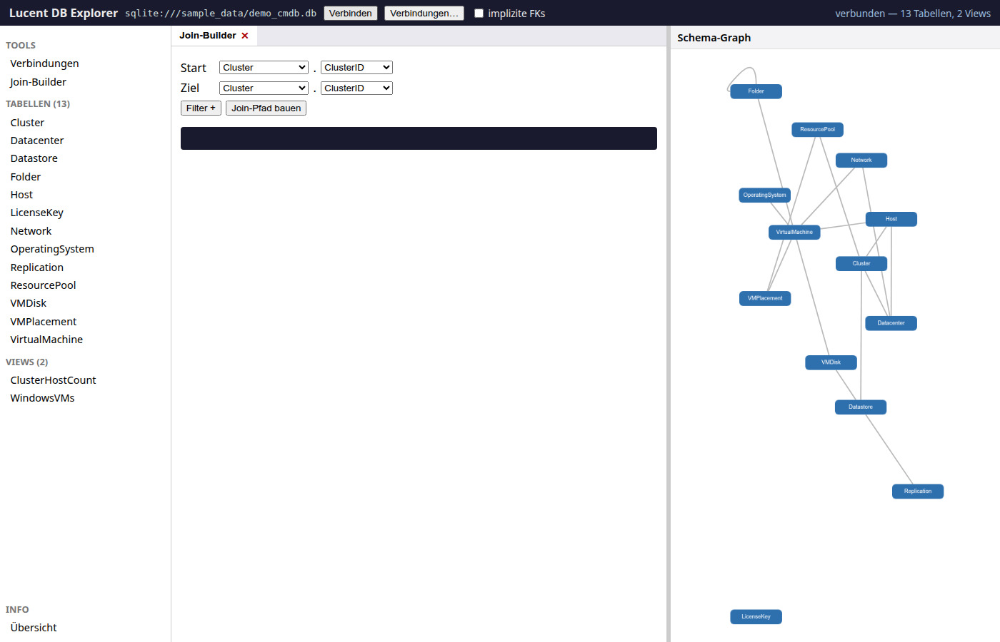
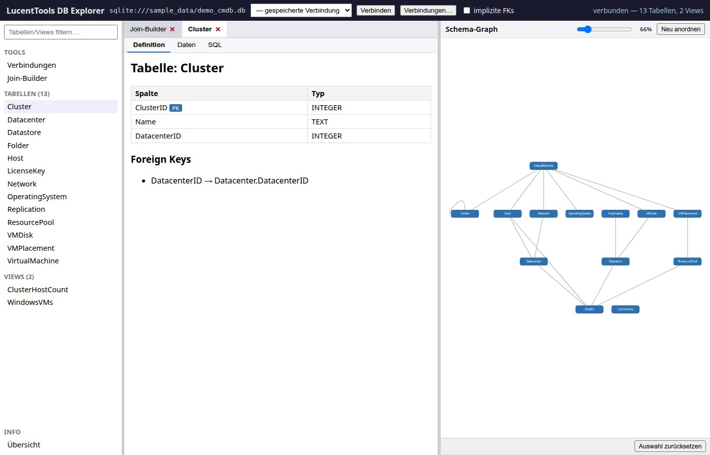
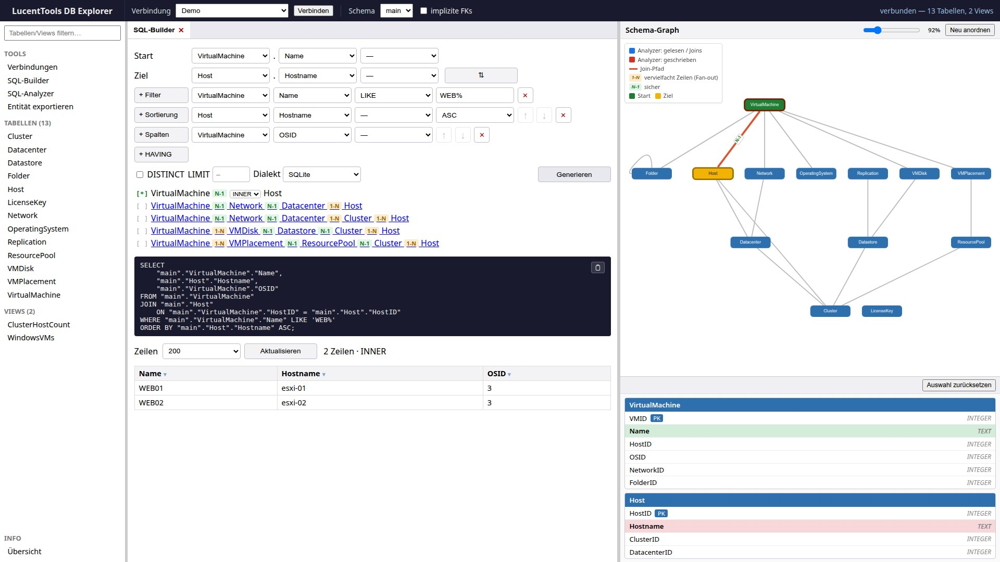
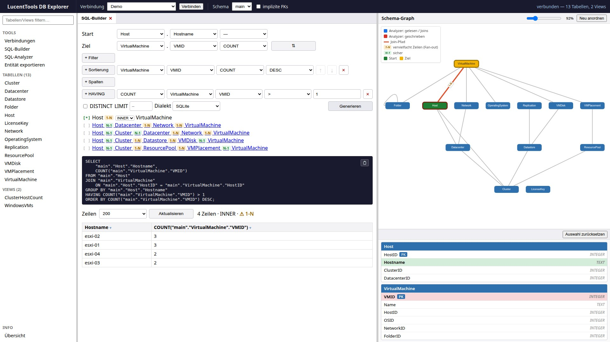
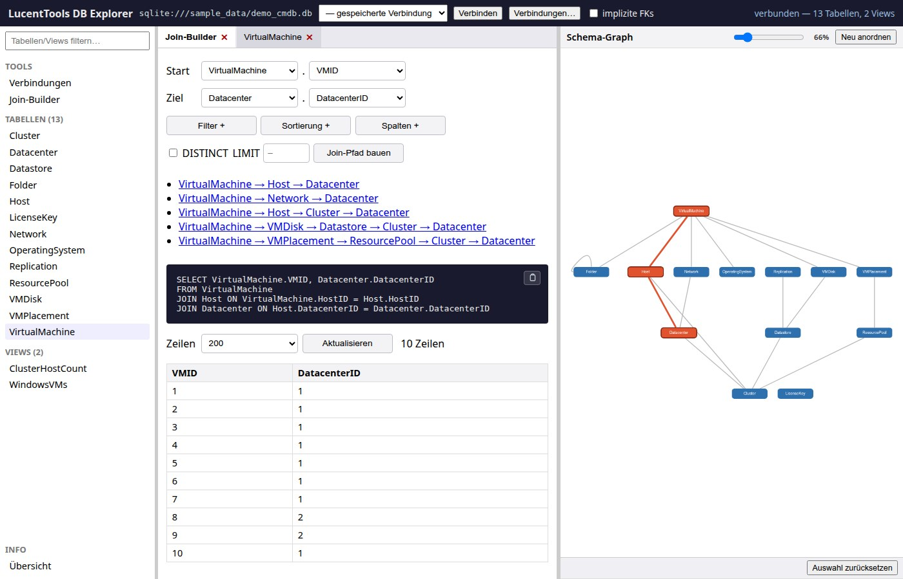
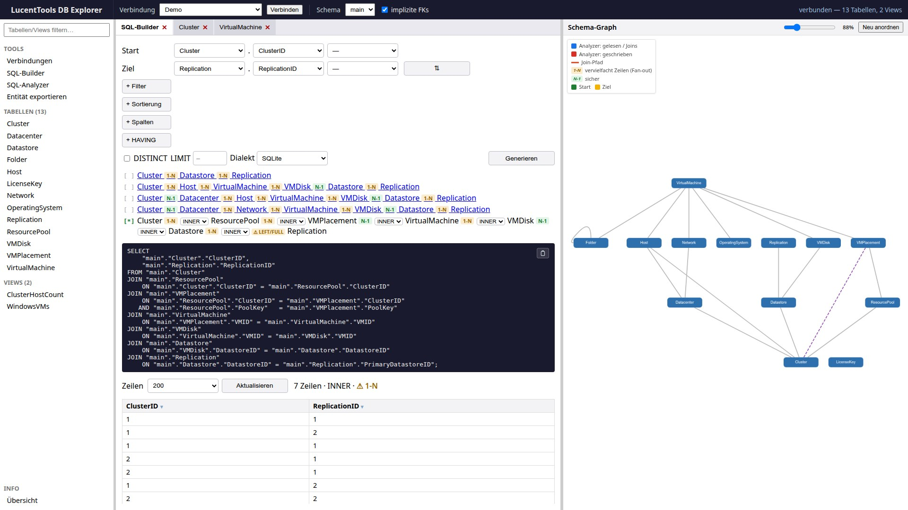

# Oberfläche

Galerie der wichtigsten Screens — Klick auf ein Bild öffnet die Lightbox-Ansicht
(Zoom, Vor/Zurück-Navigation, ESC zum Schließen).

---

## Startscreen — vor der Verbindung


Der Startscreen zeigt das 3-Panel-Grundgerüst: Topbar mit Verbindungsfeld und
„Verbinden"-Button, leerer Objekt-Browser links (TABELLEN 0 / VIEWS 0), leeres
Graph-Panel rechts. Das Verbindungsfeld ist mit dem Demo-Datenbankpfad
`sqlite:///sample_data/demo_cmdb.db` vorbelegt.

Direkt daneben liegt ein **Dropdown für gespeicherte Verbindungen** (SQL-Developer-typisch):
Eine Auswahl daraus verbindet sofort mit der gewählten Verbindung. Das Dropdown
ist mit dem Verbindungs-Tab synchronisiert (gleiche Liste, gespiegelte Auswahl);
passwortlose Verbindungen (SQLite oder Server ohne Authentifizierung) verbinden
direkt, sonst öffnet sich der Verbindungs-Tab vorbefüllt zum Ergänzen des Passworts.

Das **Verbindungsformular** (Verbindungs-Tab, überarbeitet in AP-64): das Feld
„Name zum Speichern" fluchtet jetzt mit den Feldern darüber. Unter den Feldern
stehen zwei Buttons — **„Testen"** (links) prüft die Verbindung read-only über
`/api/connect` und zeigt das Ergebnis in einem Infofeld darunter; bei
Verbindungsfehlern (z. B. unerreichbarer Host) erscheint die echte Treiber-
Fehlermeldung statt einer generischen 500-Antwort. **„Speichern"** (rechts) legt
die Verbindung in der Verbindungsliste ab. Das Schema laden erfolgt weiterhin
über die Topbar-Verbindungsauswahl (gespeicherte Verbindung auswählen).

---

## 3-Panel-Layout nach dem Verbinden



Nach „Schema laden" füllen sich Objekt-Browser (13 Tabellen, 2 Views) und der
Schema-Graph gleichzeitig. Der SQL-Builder-Tab ist standardmäßig aktiv.
Der Graph zeigt alle Tabellen als Knoten und die Foreign-Key-Beziehungen als
gerichtete Kanten.

Ein **Suchfeld** über dem Objekt-Browser filtert die Tabellen-/View-Listen live
nach Namen. Die **Sidebar-Breite** ist über einen linken Splitter per Drag
verschiebbar (analog zum Graph-Splitter). Der Button **„Neu anordnen"** im
Graph-Kopf würfelt das Layout neu; bei dichten Schemas vergrößern sich die
Knotenabstände automatisch, damit sich Knoten weniger überlappen.

---

## Tabellen-Detail — Sub-Tabs



Ein Klick auf eine Tabelle im Objekt-Browser öffnet ein Detail-Tab. Unter
**Definition** stehen Spalten mit Typ und PK-Markierung sowie die deklarierten
Foreign Keys. Weitere Sub-Tabs: **Daten** (erste 100 Zeilen als Tabelle),
**SQL** (DDL-Statement der Tabelle).

---

## SQL-Builder — Pfadliste + SQL-Ergebnis + Graph-Highlight


Nach „Generieren" listet der SQL-Builder alle k-kürzesten Pfade (bis zu 5)
als anklickbare Hyperlinks — jeder Schritt trägt einen **Richtungs-Chip** (grün N-1
aufsteigend / amber 1-N absteigend, kann Zeilen vervielfachen). Der gewählte Pfad ist
mit **`[*]`** markiert; hier ist bewusst eine **komplexe Mehrhop-Variante** ausgewählt.
Der **Join-Typ** (INNER/LEFT/RIGHT/FULL) ist pro Schritt inline in der aktiven
Pfadzeile wählbar; ein Waisen-Hinweis zeigt, welcher Typ das Ergebnis tatsächlich ändert. Das generierte,
parametrisierte SQL (mehrzeilig, Composite-Keys ausgerichtet) erscheint darunter,
gefolgt von der Ergebnistabelle. Im Schema-Graph werden die beteiligten Tabellen und
Kanten farblich hervorgehoben.

**Interaktive Ergebnistabelle (AP-45):** Ein Klick auf einen **Spaltenkopf** öffnet ein Menü mit
**Sortieren ASC/DESC**, **Als Filter…** und **Spalte entfernen**. Sortieren ergänzt eine
Sortierzeile und baut neu, „Als Filter" legt eine vorbefüllte Filterzeile an, „Spalte entfernen"
entfernt Zusatzspalten (Start-/Ziel-Spalten definieren den Pfad und sind geschützt). Sobald ein
**Filterwert gesetzt** ist (getippt oder aus dem Dropdown gewählt), wird sofort neu gebaut — die
`WHERE`-Bedingung erscheint umgehend im SQL und im Ergebnis.

**Zwei verschiedene „DISTINCT" — nicht verwechseln:**

| | erscheint im generierten SQL? | Zweck |
|---|---|---|
| **`DISTINCT`-Checkbox** (neben LIMIT/Dialekt) | **ja** — `SELECT DISTINCT …` | doppelte Ergebniszeilen unterdrücken |
| **Filter-Wertdropdown** (`/api/distinct`) | **nein** | Komfort-Lookup: zeigt die echten Werte der Spalte als Auswahlliste |

Das **Filter-Wertdropdown** ist eine **separate Hintergrundabfrage** auf *eine* Tabelle/Spalte
(`SELECT DISTINCT col FROM tabelle WHERE col IS NOT NULL ORDER BY col`, begrenzt auf
`config.DISTINCT_LIMIT`). Sie beantwortet nur die Frage „welche Werte gibt es in dieser Spalte?"
und füllt damit die Vorschlagsliste (`<datalist>`) des Wertfelds. Sie fließt **nicht** in das
angezeigte/kopierbare Join-SQL ein — dort steht weiterhin nur deine eigentliche Abfrage
(Join + deine Filter). Freitext bleibt jederzeit möglich.

---

## SQL-Builder — Filter, Sortierung & zusätzliche Spalten



Die Klausel-Sektionen (**Filter**, **Sortierung**, **Spalten**) wirken zusammen.
Beispiel: Start `VirtualMachine.Name`, Ziel `Host.Hostname`, dazu eine **Zusatzspalte**
(`+ Spalten` → `VirtualMachine.OSID`), ein **Filter** (`+ Filter` → `VirtualMachine.Name
LIKE 'WEB%'`) und eine **Sortierung** (`+ Sortierung` → `Host.Hostname ASC`). Das erzeugte,
read-only SQL bündelt sie zu mehrspaltigem `SELECT` + `JOIN` + `WHERE` + `ORDER BY`:

```sql
SELECT "main"."VirtualMachine"."Name",
       "main"."Host"."Hostname",
       "main"."VirtualMachine"."OSID"
FROM "main"."VirtualMachine"
JOIN "main"."Host" ON "main"."VirtualMachine"."HostID" = "main"."Host"."HostID"
WHERE "main"."VirtualMachine"."Name" LIKE 'WEB%'
ORDER BY "main"."Host"."Hostname" ASC;
```

---

## SQL-Builder — Aggregat mit GROUP BY & HAVING

 1 und eine Sortierung nach COUNT DESC. Das SQL zeigt die volle Klauselkette SELECT … COUNT(…) … JOIN … GROUP BY … HAVING … ORDER BY; die Ergebnistabelle listet vier Hosts mit mehr als einer VM.">

Trägt eine SELECT-Spalte ein **Aggregat** (COUNT/SUM/AVG/MIN/MAX), wird das **GROUP BY**
automatisch aus den nicht-aggregierten Spalten abgeleitet. Beispiel „Hosts mit mehr als
einer VM": Start `Host.Hostname`, Ziel `VirtualMachine.VMID` mit Aggregat **COUNT**, eine
**HAVING**-Bedingung (`+ HAVING` → `COUNT(VMID) > 1`) filtert die Gruppen, eine **Sortierung**
nach `COUNT(VMID) DESC` ordnet sie. Klauselreihenfolge: **WHERE → GROUP BY → HAVING → ORDER BY**.

```sql
SELECT "main"."Host"."Hostname",
       COUNT("main"."VirtualMachine"."VMID")
FROM "main"."Host"
JOIN "main"."VirtualMachine" ON "main"."Host"."HostID" = "main"."VirtualMachine"."HostID"
GROUP BY "main"."Host"."Hostname"
HAVING COUNT("main"."VirtualMachine"."VMID") > 1
ORDER BY COUNT("main"."VirtualMachine"."VMID") DESC;
```

Der HAVING-Vergleichswert wird für die read-only Vorschau-Ausführung typgerecht gebunden
(numerische Werte als Zahl), damit die Gruppenfilterung auch in SQLite korrekt greift.

---

## SQL-Builder — parallele Tab-Ansicht



Tabellen-Detail-Tabs und der SQL-Builder-Tab koexistieren in der Tab-Leiste.
Mehrere Tabellen können gleichzeitig geöffnet bleiben; ein Klick auf den Tab
wechselt die Ansicht ohne den Graph-Zustand zu verlieren.

---

## Schema-Graph mit impliziten FKs



Die Checkbox **„implizite FKs"** in der Topbar aktiviert die SchemaSpy-Heuristik:
Spalten, deren Name auf einen Primärschlüssel einer anderen Tabelle schließen
lässt, werden als gestrichelte Kanten eingezeichnet. Nützlich für Datenbanken
ohne deklarierte Foreign Keys (z. B. `demo_cmdb_nofk.db`).

---

## AP-1: Interaktive Pfad-Auswahl direkt im Graph


**Neu in AP-1:** Doppelklick auf einen Graph-Knoten öffnet eine **UML-Tabellenkarte**
direkt im Graph-Panel mit allen Spalten, Typen und PK-Markierungen. Eine Spalte
anklicken setzt die Quelle; Doppelklick auf eine zweite Tabelle + Spaltenwahl
setzt das Ziel. Sobald Quelle und Ziel gesetzt sind:

- `/api/joinpath` wird automatisch aufgerufen
- Der Join-Pfad wird im Graph **rot hervorgehoben**
- Der **SQL-Builder-Tab füllt sich automatisch** mit den gewählten Tabellen und
  Spalten (Zweiweg-Sync Graph ↔ SQL-Builder)

Die Statuszeile am unteren Graph-Rand zeigt die aktuelle Auswahl
(`Quelle: VirtualMachine.HostID → Ziel: Host.HostID`) und bietet einen
„Auswahl zurücksetzen"-Button.

---

## SQL-Builder — aktuelle Funktionen (Stand v0.44.0)

Über die obigen Screenshots hinaus bietet der SQL-Builder inzwischen:

- **Layout — vier Klausel-Sektionen + Aktionsleiste:** Die Klausel-Builder
  (Filter, Sortierung, Spalten, HAVING) sind als vier eigenständige, immer
  sichtbare Abschnitte mit beschrifteter Überschrift und je einem kompakten
  „+"-Button dargestellt. Die Ausgabe-Optionen (DISTINCT, LIMIT, Dialekt) und
  der „Generieren"-Button befinden sich in einer getrennten Aktionsleiste am
  unteren Rand. Nur Markup/CSS — alle Element-IDs und das generierte SQL sind
  unverändert.
- **Start ⇄ Ziel tauschen** per ⇄-Knopf neben den Ziel-Dropdowns (Tabelle + Spalte;
  baut sofort neu) — die warnungsfreie Richtung ist oft die umgekehrte.
- **Pfad-Auswahl-Indikator:** Die Kandidatenpfade tragen `[*]` (aktiv) / `[ ]` statt
  Bullets; jeder Join-Schritt hat einen **Richtungs-Chip** grün `N-1` / gelb `1-N`.
- **Join-Typ pro Schritt** (INNER/LEFT/RIGHT/FULL): Die Dropdowns sitzen direkt inline
  in der aktiven Kandidatenpfad-Zeile, neben den Richtungs-Chips. Es gibt keine
  separate Join-Typ-Zeile mehr. Ein **Waisen-Chip** zeigt datengetrieben, welcher Typ
  hier *tatsächlich* zusätzliche Zeilen bringt (siehe [Outer Joins & Waisen](outer-joins.md)).
- **Zeilen-Reihenfolge per ↑/↓ (AP-E):** Sortier-Zeilen (ORDER BY) und Spalten-Zeilen
  tragen kleine ↑/↓-Buttons zum Verschieben innerhalb ihrer Sektion. Die Reihenfolge
  bestimmt die erzeugte SQL: ORDER BY = Sortier-Priorität, Spalten = SELECT-/GROUP-BY-
  Reihenfolge. Das ↑ der ersten und das ↓ der letzten Zeile sind deaktiviert; das
  Verschieben wird mit „Generieren" angewandt. WHERE/HAVING haben bewusst kein Move
  (ihre Reihenfolge ist kosmetisch).
- **Lesbares, mehrzeiliges SQL** (eine Spalte/JOIN/ON-Bedingung pro Zeile,
  ausgerichtete `=`); das angezeigte/kopierte SELECT ist **direkt lauffähig**
  (Filterwerte eingesetzt, endet mit `;`) — intern wird parametrisiert read-only
  ausgeführt.
- **Ergebnistabelle:** Statuszeile *Zeilen · Join-Typ · Fan-out*; **NULL-Zellen**
  (Outer-Join-/Waisen-Zeilen) hervorgehoben.
- **Detailkarten:** Sind Start/Ziel gewählt (auch per Dropdown), rückt der Graph nach
  oben und darunter erscheinen die Tabellen-Detailkarten für Start/Ziel; ohne Auswahl
  bleibt der Graph zentriert.

## Schema-Graph — Legende

Oben links erklärt eine kleine Legende die Hervorhebungen: **blau** = Analyzer
(gelesen/Joins), **rot** = Analyzer (geschrieben), **orange** = Join-Pfad,
**N-1/1-N** = Join-Richtung (N-1 sicher / 1-N kann Zeilen vervielfachen),
**grün/amber** = Start/Ziel. Join-Pfad- und Analyzer-Markierungen sind
wechselseitig exklusiv. Die Fan-out-Bedeutung (1-N vervielfacht Zeilen / N-1
sicher) wird in der Legende erklärt; der SQL-Builder zeigt keine separate
Fan-out-Kachel mehr.

## SQL-Analyzer

Der **SQL-Analyzer**-Tab parst ein eingefügtes Statement **read-only** (nie
ausgeführt) via sqlglot und zeigt: Typ, **Komplexitäts-Score** (A–E),
Struktur-Zähler, Spalten, **Joins (Typ + ON)**, **Filter/GROUP BY/HAVING/ORDER BY**,
gelesene/geschriebene Tabellen sowie Warnungen/Lints (u. a. `SELECT *`, `LIKE '%…'`,
Funktion-auf-Spalte, sowie `SUSPICIOUS_ALIAS` für vertippte Join-Schlüsselwörter).
Die JOIN-Kanten des Statements werden im Graph gezeichnet. Mit aktiver Verbindung
zusätzlich `UNKNOWN_TABLE`/`UNKNOWN_COLUMN`.

**Optimierungs-Vorschläge (AP-F):** ein eigener, von den Warnungen getrennter
Abschnitt mit vier schema-freien AST-Heuristiken — überflüssiges `DISTINCT` neben
`GROUP BY`, `ORDER BY` ohne `LIMIT`, `OR` im Top-Level-`WHERE` (kann Indexnutzung
verhindern) und eine Nicht-`EXISTS`-Unterabfrage in `WHERE` (oft besser als
JOIN/EXISTS). Read-only, nur Hinweise — der Analyzer schreibt nichts um.

## Info / Übersicht — Cross-Schema-FK-Diagnose (AP-54)

Das **Info**-Panel (Sidebar → Info → Übersicht) zeigt neben Tabellen-/Views-/FK-Zählern
eine Zeile **„Cross-Schema-FKs"**: die Anzahl der Foreign Keys, die auf ein **anderes
Schema** als das reflektierte zeigen, und — falls vorhanden — darunter die Kantenliste
`Tabelle.Spalte → Schema.Tabelle.Spalte`. Damit ist read-only ablesbar, ob die verbundene
Datenbank Cross-Schema-FKs nutzt (Entscheidungsgrundlage für eine spätere volle
Cross-Schema-Join-Unterstützung). SQLite hat keine Schemas → dort immer 0.

## Modus „Entität exportieren" — Database-Subsetting (AP-56)

Der Tab **„Entität exportieren"** berechnet aus einer **Start-Tabelle** und einem optionalen
**Wurzel-Filter** (Spalte / Operator / Wert) die **referenzielle FK-Hülle** der Start-Entität:
abhängige Kind-Tabellen werden abwärts verfolgt (Tabellen, die über einen FK auf die
Start-Tabelle zeigen), Lookup-Eltern aufwärts (Tabellen, auf die die Start-Tabelle zeigt) —
„down-then-up" ohne Re-Descent, zyklus-sicher und tiefenbegrenzt. Jede einbezogene Tabelle
erhält eine **Rolle** (`root` / `child` / `parent`) + `via_table`-Einstufung.

Auf der berechneten Hülle bietet der Modus vier **read-only** Aktionen (Buttons):

| Button | Endpoint | Wirkung |
|---|---|---|
| **Footprint bauen** | `/api/subset` (AP-56a) | Hüll-Tabellen + SELECT-Skelett je Tabelle (zur Wurzel gejoint). Führt nichts aus. |
| **Zeilen zählen (live)** | `/api/subset/run` (AP-56b·1) | echte **Zeilenzahl** je Tabelle + Summe (resilient pro Tabelle; markiert „unvollständig" bei Truncation/Fehler) |
| **Daten-Dump (JSON)** | `/api/subset/dump` (AP-56b·2) | lädt die echten Zeilen der Hülle als **JSON-Bundle** herunter (Browser-Blob; Per-Tabelle-Cap `MAX_RESULT_ROWS` + lautes Truncation-Flag) |
| **IN-Listen (SQL)** | `/api/subset/inlists` (AP-56c) | lädt je Tabelle die **PK-Identität** als `.sql` herunter (`SELECT * … WHERE pk IN (…)`, Composite-PK als portable `(a=… AND b=…) OR …`) |

**Read-only durchgängig:** nichts wird geschrieben; Zähl-/Dump-/IN-Listen-Aktionen führen nur
parametrisierte SELECT/COUNT aus. No-PK-Tabellen werden bei den IN-Listen laut markiert.

## Read-only Objekt-Kategorien (AP-63)

Über Tabellen/Views hinaus zeigt die Oberfläche weitere DB-Objekte read-only an (keine Join-/
SQL-Teilnahme):

- **Indizes + Check-Constraints** (AP-63·S1): im Tabellen-Detail („Definition") als genestete
  Abschnitte — alle Indizes (Name/Spalten, `unique`-Badge) und Check-Constraints (Name/Ausdruck).
- **Trigger** (AP-63·S2): eigene Sidebar-Kategorie „Trigger" (nur wenn vorhanden); schlankes
  Detail mit besitzender Tabelle + `CREATE TRIGGER`-Quelltext, **ohne** Daten-Tab. Reflektion
  aktuell nur SQLite (Katalog-SQL).
- **Sequences + Materialized Views** (AP-63·S2b): je eigene Sidebar-Kategorie (nur wenn
  vorhanden) — Sequenzen zeigen den Namen, Materialized Views Spalten + Definition (display-only).
  Echte Reflektion nur PostgreSQL/Oracle.

## Info / Übersicht — Implizite (geratene) Foreign Keys (AP-55)

Das **Info**-Panel listet zusätzlich die **implizit erkannten (geratenen) Foreign Keys**
mit ihrer Confidence-Stufe (hoch/mittel/niedrig). Jeder Eintrag ist klar als Schätzung
markiert — es wird kein FK angelegt und das generierte SQL ändert sich nicht. Die
Confidence-Erkennung basiert auf Suffix→Tabellenname-Matching (Groß/Klein-, Trenner-
und Plural-normalisiert) gegen Tabellen mit konventionellem Einzel-Spalten-PK.
