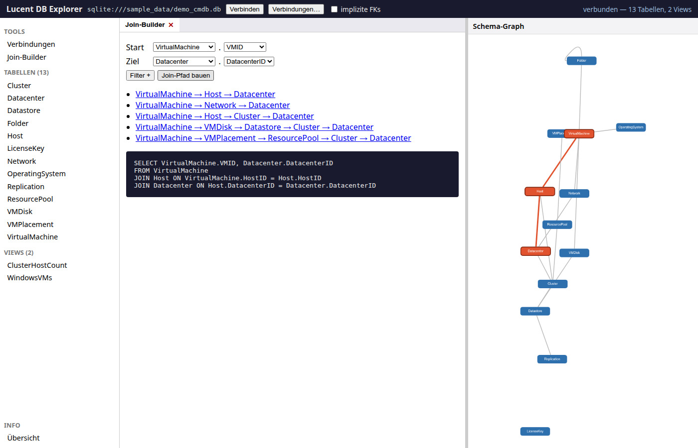

# UseCases

## UC-1: Join-Pfad zwischen zwei Tabellen berechnen

**Ziel:** Vom Schema einer unbekannten Datenbank schnell ein korrektes
JOIN-Statement von Tabelle A nach Tabelle B erzeugen.

**Ablauf:**

1. Datenbankverbindung eingeben → Schema laden
2. Im Join-Builder Start-Tabelle + Start-Spalte wählen
3. Ziel-Tabelle + Ziel-Spalte wählen
4. „Join-Pfad berechnen" klicken
5. Das generierte SQL in die eigene Query übernehmen

**Ausgabe:** Parametrisiertes SQL mit allen nötigen JOINs. Bis zu 5 alternative
Pfade (k-kürzeste Pfade) werden angezeigt, falls mehrere Routen existieren.

---

## UC-2: Gefilterte Abfrage erstellen

**Ziel:** Ein JOIN mit einer WHERE-Bedingung über eine Zwischentabelle erzeugen.

**Ablauf:**

1. Join-Pfad wie in UC-1 definieren
2. Über „Filter +" eine Filterzeile hinzufügen:
   - Tabelle auswählen (aus dem Pfad oder erreichbaren Tabellen)
   - Spalte auswählen
   - Operator wählen (`=`, `!=`, `<`, `>`, `LIKE`, `IS NULL`, …)
   - Wert eingeben
3. Mehrere Filter werden mit UND verknüpft

**Ausgabe:** SQL mit `WHERE`-Klausel und parametrisierten Platzhaltern.

---

## UC-3: FK-Graph erkunden

**Ziel:** Die Beziehungsstruktur einer unbekannten Datenbank visuell verstehen.

**Ablauf:**

1. Schema laden → Graph-Panel rechts zeigt alle Tabellen und FKs
2. Knoten können verschoben werden (Force-directed Layout)
3. Nach Berechnung eines Join-Pfads: der gewählte Pfad wird farblich hervorgehoben

**Implizite FKs:** Checkbox „Implizite FKs einbeziehen" aktivieren → der Graph
zeigt gestrichelte Kanten für heuristisch erkannte Beziehungen (Name-Matching
auf Primärschlüssel-Spalten).

---

## UC-4: Tabellen-Daten vorab prüfen

**Ziel:** Bevor man eine Query schreibt, die ersten Zeilen einer Tabelle sehen.

**Ablauf:**

1. Im Objekt-Browser links auf eine Tabelle oder View klicken
2. Tab „Daten" wählen → erste 100 Zeilen werden geladen

**Hinweis:** Nur `SELECT … LIMIT 100` — kein Schreibzugriff, Objektname gegen
reflektiertes Schema validiert.

---

## UC-5: Verbindung zu einer Produktionsdatenbank speichern

**Ziel:** Häufig genutzte Verbindungen nicht jedes Mal neu eingeben müssen.

**Ablauf:**

1. Tools → Verbindungen öffnen
2. DB-Typ wählen, Felder ausfüllen, Verbindung testen
3. Name vergeben und speichern

**Hinweis:** Das Passwort wird nicht gespeichert — nur Typ, Host, Port,
Datenbankname und Benutzer werden in `config.json` abgelegt.

---

## UC-6: Schema ohne deklarierte FKs erschließen (Implizite FKs)

**Ziel:** Join-Pfade in einer Legacy-Datenbank finden, die keine FK-Constraints
definiert.

**Ablauf:**

1. `demo_cmdb_nofk.db` verbinden (oder eigene FK-freie DB)
2. Schema laden — der Graph zeigt zunächst nur isolierte Knoten
3. Checkbox „Implizite FKs einbeziehen" aktivieren
4. Graph aktualisiert sich mit gestrichelten Kanten → Join-Pfade berechnen wie gewohnt

**Heuristik:** Spaltennamen der Form `<tabelle>_id` oder `<tabelle>id` werden
auf einspaltigen Primärschlüssel einer anderen Tabelle abgebildet, wenn die
Typen kompatibel sind.
